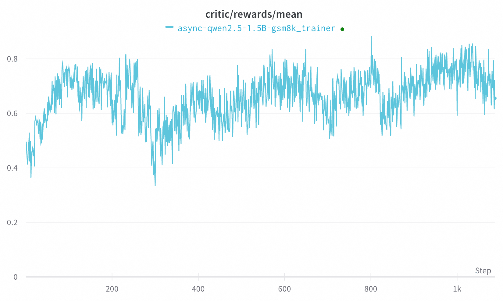

# A quick example for asynchronous mode

This example shows how to run RFT in asynchronous mode with the Qwen-2.5-1.5B-Instruct model and GSM8K dataset.

Trinity-RFT supports an asynchronous mode by running the trainer and explorer in separate processes.

For this purpose, we prepare two main config files: `trainer.yaml` and `explorer.yaml`.
The main difference between them is that in `trainer.yaml` we set `mode=train`, while in `explorer.yaml` we set `mode=explore`.
In addition, we need to configure the following parameters in both files.
The synchronization frequency is defined as every `sync_iteration_interval * batch_size` tasks.

```yaml
data:
  batch_size: <batch_size>
# The same checkpoint path
model:
  checkpoint_path: /PATH/TO/CHECKPOINT

# The same data_base path
buffer:
  train_dataset:
    name: gsm8k_buffer
    storage_type: queue
    path: 'sqlite:///gsm8k.db'

synchronizer:
  sync_method: 'checkpoint'
  sync_iteration_interval: <sync_iteration_interval>
```

You may run this examples by running the following command:

```bash
bash examples/async_gsm8k/run.sh
```

In the following, we show the results of asynchronous mode in the following.


