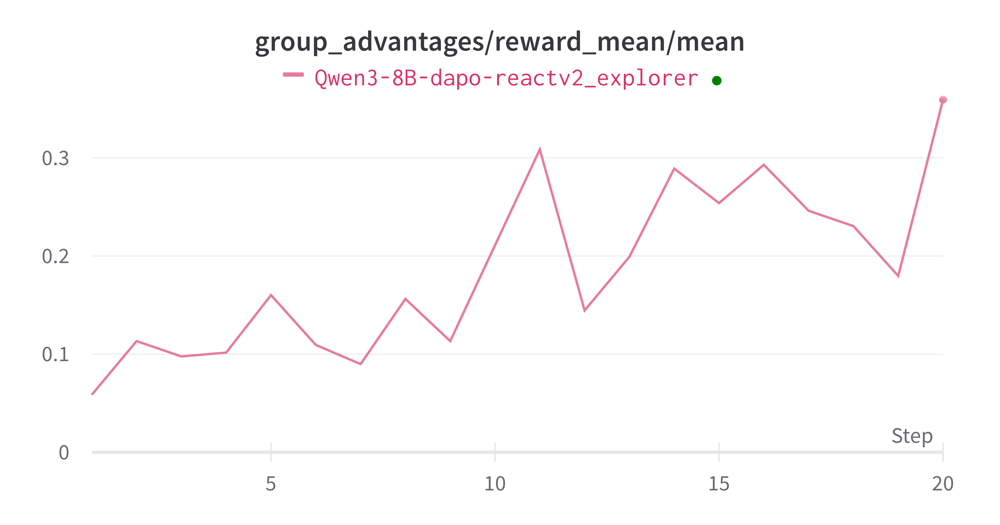
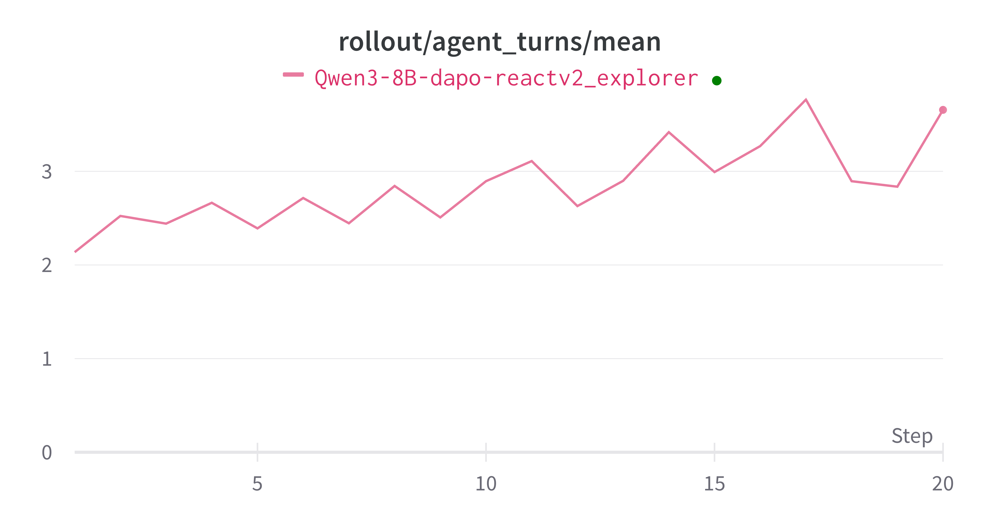

# ReAct Agent 训练示例

本节将会展示如何借助 Trinity-RFT 训练一个基于智能体框架实现的 ReAct Agent。这里我们以 [AgentScope](https://github.com/modelscope/agentscope) 框架为例，并使用其内置的 ReAct 智能体来解决 GSM8K 数学问题。开发者可以参考此示例，将 Trinity-RFT 的训练工作流适配到自己的智能体项目中。


## 关键特性

在介绍案例之前，我们先来看看 Trinity-RFT 在训练智能体应用方面的几个重要特性。

### 兼容各种智能体框架

当前智能体开发框架众多，对模型的封装和调用方式也各不相同。为了最大限度地兼容各种框架，Trinity-RFT 对 `openai.OpenAI` 以及 `openai.AsyncOpenAI` 接口进行了封装，只要你的智能体框架支持使用 openai 接口调用模型，就可以通过 Trinity-RFT 提供的 `OpenAI` 或是 `AsyncOpenAI` 实例对智能体进行训练。当然，你也可以不使用任何智能体框架，直接借助 Trinity-RFT 提供的 openai 接口实现自己的智能体。


### 无需修改智能体代码

智能体的训练需要收集智能体运行中产生的对话历史以及其他相关信息（例如 `token_id`，`logprobs`），这往往需要对智能体应用代码进行一定的修改。Trinity-RFT 通过封装 `openai.OpenAI` 或 `openai.AsyncOpenAI` 实例的方式，在模型调用时自动收集训练所需的各种信息，从而避免了对智能体自身代码的修改。


### 支持多轮次交互

智能体任务通常涉及多步推理、工具使用和观察。为了支持训练智能体应用，Trinity-RFT 原生支持包含多轮交互的训练任务，且不限制交互轮次（但 token 总长度不能超过模型所能支持的上限），这意味着你可以根据任务的复杂度，设计动态长度的交互过程。不同于其他框架通过补充空数据的方式凑够固定长度的交互，Trinity-RFT 通过动态同步机制，能够在收集到足够的训练样本后立即启动训练任务，从而提升训练效率。


## 实现流程

我们将逐步介绍如何使用 Trinity-RFT 训练一个基于 AgentScope 实现的 ReAct 智能体。


### 1. 引入 Agent 类

({class}`trinity.common.workflows.agentscope.react.react_agent.AgentScopeReActAgent`)封装了 AgentScope 的 ReAct 智能体，并在初始化时注入 Trinity-RFT 提供的 `openai.AsyncOpenAI` 实例，而后续的执行过程均由 AgentScope 智能体自行处理，无需任何修改。


```python
# A simplified version of trinity.common.workflows.agentscope.react.react_agent.AgentScopeReActAgent
class AgentScopeReActAgent:
    def __init__(
        self,
        openai_client: openai.AsyncOpenAI,
        # some other params
    ):
        """Initialize the AgentScope ReAct agent with specified tools and model.

        Args:
            openai_client (openai.AsyncOpenAI): An instance of AsyncOpenAI client.
        """
        self.agent_model = OpenAIChatModel(
            api_key="EMPTY",
            model_name=model_name,
            generate_kwargs=generate_kwargs,
            stream=False,
        )
        # patch the OpenAIChatModel to use the openai_client provided by Trinity-RFT
        self.agent_model.client = openai_client
        self.agent = ReActAgent(
            name="react_agent",
            model=self.agent_model,
        )

    async def reply(self, query: str) -> BaseModel:
        """Generate a response based on the query."""
        # no need to modify your agent logic
        return await self.agent.reply(
            Msg("user", query, role="user")
        )
```

### 2. 实现训练工作流


({class}`trinity.common.workflows.agentscope.react.react_workflow.AgentScopeReActWorkflow`) 展示了智能体的训练流程，其核心 `run_async` 方法包含三个步骤：

  1. 调用智能体完成指定任务并获取任务结果。
  2. 对任务结果进行评估，计算奖励。
  3. 收集任务执行中产生的可训练数据并集合奖励生成训练样本（`Experience`）。

```python
# A simplified version of trinity.common.workflows.agentscope.react.react_workflow.AgentScopeReActWorkflow
class AgentScopeReActWorkflow(Workflow):
    def __init__(
        self,
        *,
        task: Task,
        model: ModelWrapper,
        auxiliary_models: Optional[List[openai.OpenAI]] = None,
    ):
        # initialize the agent
        self.agent = AgentScopeReActAgent(
            openai_client=model.get_openai_client(),
            # some other params
        )
        # get query from the task
        self.query = task.raw_task.get(task.format_args.prompt_key)  # type: ignore [index]

    async def run_async(self):
        """Run the workflow asynchronously."""
        # Step 1: call the ReAct agent to solve the task
        response = await self.agent.reply(self.query)
        # Step 2: calculate the reward based on the response
        reward = await self.calculate_reward(response)
        # Step 3: construct experiences from the interaction history and return them
        return self.construct_experiences(reward)

    async calculate_reward(self, response) -> float:
        """Calculate the reward based on the response."""
        # your reward logic

    def construct_experiences(self, reward: float) -> List[Experience]:
        """Construct experiences from the agent's interaction history.

        Returns:
            List: A list of Experience objects.
        """
        # Extract all interaction history generated by this task
        exps = self.model.extract_experience_from_history()
        # update the reward for each experience
        for exp in exps:
            exp.reward = reward
        return exps

```

### 3.训练配置

Trinity-RFT 借助配置文件来控制整个训练流程，下面是本示例的关键配置参数说明。

#### 推理模型配置

`explorer.rollout_model` 部分负责配置智能体应用所使用的模型，其中的关键参数如下：


```yaml
explorer:
  rollout_model:
    # ...
    enable_openai_client: true     # 启用 OpenAI Client
    enable_history: true           # 启用调用历史自动记录
    enable_auto_tool_choice: true  # 允许模型生成 `tool_calls`
    tool_call_parser: hermes       # 指定格式化解析工具调用输出的解析器
    reasoning_parser: deepseek_r1  # 有助于解析模型的思维过程
    enable_thinking: true          # 是否允许思考（主要针对 Qwen3 系列模型）
```

#### 多步训练算法

`algorithm` 部分负责配置智能体应用所使用的训练算法，其中的关键参数如下：

```yaml
algorithm:
  algorithm_type: grpo
  advantage_fn: step_wise_grpo # 多步训练的关键，该策略告诉 Trinity 为智能体执行路径中的每一步创建独立的训练样本。`grpo` 算法随后使用这些样本来更新模型。
```

#### 动态同步配置

由于智能体应用在完成不同任务时，交互轮次往往不固定，为此需要开启 Trinity-RFT 的动态同步功能，以便在收集到足够的训练样本后立即启动训练任务，从而提升训练效率。相关配置如下：

```yaml
synchronizer:
  sync_style: dynamic_by_explorer # 当产生足够训练数据时，trainer 立即启动训练任务，而不是对生成的数据补齐到一个固定规模，能够有效提升训练效率
  sync_interval: 2  # 每隔两步检查是否有足够的数据启动训练
```


## 运行示例

1. 安装依赖库：按照 [安装指南](/tutorial/installation.md) 成功安装 Trinity-RFT，并且安装了 AgentScope 的 v1.0 及以上版本。

```bash
pip install agentscope>=1.0.5
```

2. 下载模型和数据集:

```bash
huggingface-cli download Qwen/Qwen3-8B
huggingface-cli download openai/gsm8k --repo-type dataset
huggingface-cli download open-r1/GSM8K-Processed --repo-type dataset
```

3. 启动训练任务:

  ```bash
  # Navigate to the Trinity-RFT root directory
  cd /path/to/Trinity-RFT

  # For GSM8k dataset:
  trinity run --config examples/agentscope_react/gsm8k.yaml

  # For DAPO dataset:
  trinity run --config examples/agentscope_react/dapo.yaml
  ```


## 结果展示

### GSM8k 数据集

reward 变化曲线：


Agent 交互轮次变化曲线：


### DAPO 数据集

reward 变化曲线：



Agent 交互轮次变化曲线：

