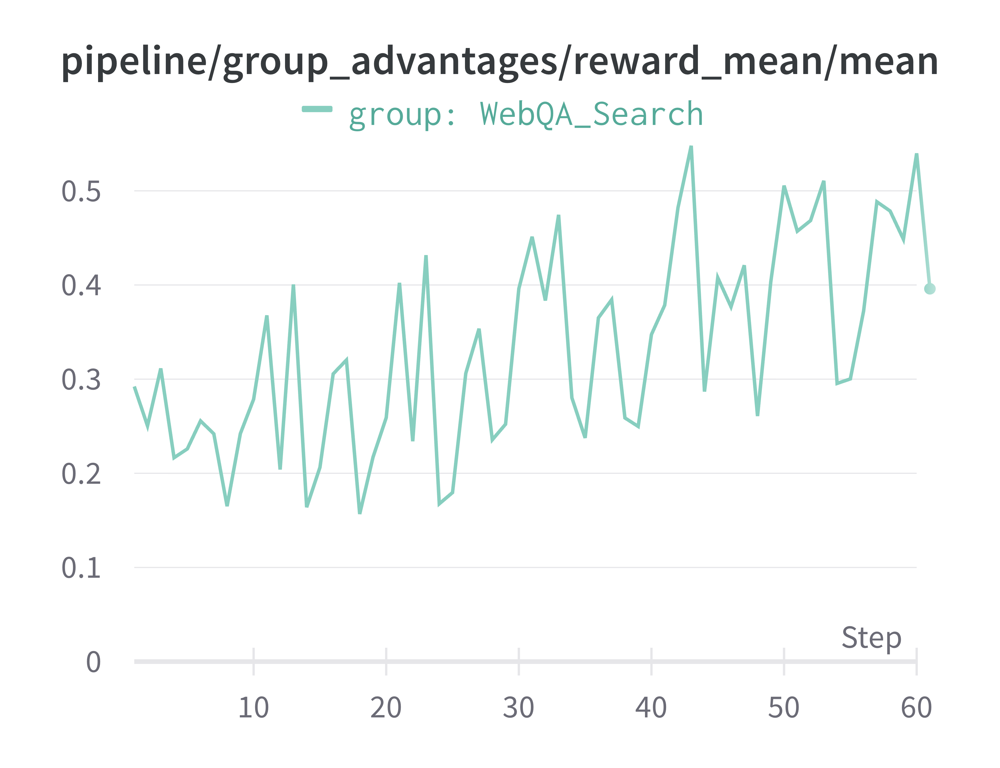

# Example of Training a Multi-Turn Web Search Agent

This example demonstrates how to train a multi-turn web search agent based on the ReAct (Reasoning and Acting) paradigm.
It utilizes the **AgentScope ** framework, integrated within the Trinity workflow, to equip an agent with external search tools to find information on the web and answer questions.

We use a subset of the `WebWalkerQA` dataset here. The original dataset can be found at [Hugging Face Datasets](https://huggingface.co/datasets/callanwu/WebWalkerQA).

The config file is located in [`agentscopev1_websearch_agent.yaml`](agentscopev1_websearch_agent.yaml).

## Key Features

*   **Training Multi-Turn ReAct Agent**: The workflow trains a `ReActAgent` from AgentScope that can reason and act in multiple steps.
*   **External Tool Integration**: The agent connects to web search tools via AgentScope's Message-based Communication Protocol (MCP). It supports:
    *   **Tavily Search** (`tavily`)
    *   **SearXNG** (`searxng`)
*   **LLM-based Evaluation**: The agent's final answer is evaluated by an auxiliary "judge" LLM against a ground-truth answer to generate a reward signal for training. It is set by the auxiliary model.
*   **Asynchronous Execution**: The workflow is designed to run asynchronously, improving performance.

## Prerequisites

Before running this workflow, ensure you have the following set up:

1.  **Dependencies**: Install the required AgentScope framework.
    ```bash
    pip install "agentscope"
    ```
    The specific MCP clients (`tavily-mcp` and `mcp-searxng`) will be automatically installed via `npx` on the first run.

2.  **Environment Variables**: You must configure the environment variables for the search tool you intend to use.

    *   For [Tavily Search](https://tavily.com/), set your API key:
      ```bash
      export TAVILY_API_KEY="your_tavily_api_key"
      ```
    *   For [SearXNG](https://docs.searxng.org/), set the URL of your SearXNG instance:
      ```bash
      export SEARXNG_URL="http://your-searxng-instance.com"
      ```

## Configuration

All workflow parameters can be configured in the [`agentscopev1_websearch_agent.yaml`](agentscopev1_websearch_agent.yaml) file. Key options under `workflow_args` include:

*   `search_client_type`: The search tool to use. Must be either `"tavily"` or `"searxng"`. If you want to use other search tools, you should make changes in the `trinity/common/workflows/envs/agentscope/agentscopev1_search_workflow.py`.
*   `max_turns`: The maximum number of reasoning/acting steps the agent can take.


## Result
Below we provide the training curve of running using `tavily` search tools:




It takes around 8 hours on 8 H20 GPUs.
