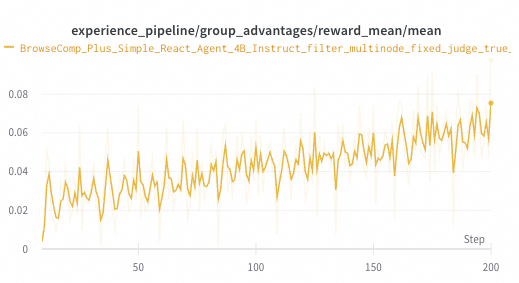
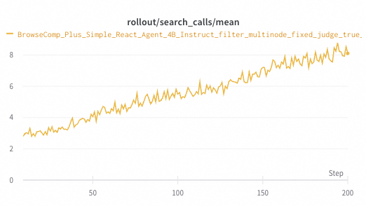

# Example of Training a BrowseComp-Plus Search Agent

This example demonstrates how to train a web search and information retrieval agent on the **BrowseComp-Plus** dataset using the ReAct (Reasoning and Acting) paradigm.

BrowseComp-Plus is a comprehensive benchmark for evaluating information retrieval and question answering capabilities. The original dataset and benchmark can be found at [BrowseComp-Plus GitHub](https://github.com/texttron/BrowseComp-Plus).

The config file is located in [`bcp_config.yaml`](bcp_config.yaml).

## Key Features

*   **Training ReAct Agent**: The workflow trains a ReAct agent that can reason and act with search tools to find information and answer questions.
*   **Local Search Integration**: The agent uses local BM25 or dense retrieval search (no external API required) via BrowseComp-Plus's built-in searcher.
*   **Tool-based Interaction**: The agent can:
    *   **Search**: Query the search index to find relevant documents
    *   **Get Document** (optional): Retrieve full document content by document ID
*   **LLM-as-Judge Evaluation**: The agent's final answer is evaluated by an auxiliary "judge" LLM against ground-truth answers to generate reward signals for training.
*   **Asynchronous Execution**: The workflow is designed to run asynchronously for better performance.

## Prerequisites

Before running this workflow, please complete the following setup steps.

### 1. Install BrowseComp-Plus

Clone and set up the BrowseComp-Plus repository:

```bash
# Clone the repository
git clone https://github.com/texttron/BrowseComp-Plus.git

# Set the environment variable (add this to your ~/.bashrc or ~/.zshrc for persistence)
export BROWSECOMP_PATH="/path/to/BrowseComp-Plus"

# Install dependencies
cd $BROWSECOMP_PATH
pip install -r requirements.txt
```

### 2. Download and Decrypt the Dataset

Follow the instructions in BrowseComp-Plus to download and decrypt the dataset:

```bash
cd $BROWSECOMP_PATH

# Download the encrypted dataset
# Follow instructions at: https://github.com/texttron/BrowseComp-Plus#data
python scripts_build_index/decrypt_dataset.py --output data/browsecomp_plus_decrypted.jsonl --generate-tsv topics-qrels/queries.tsv
```

### 3. Build the Search Index

Build the BM25 search index (or other index types if preferred):

```bash
cd $BROWSECOMP_PATH

# Build Search index
bash scripts_build_index/download_indexes.sh

# (Optional) To try out other retrieval index methods, please refer to instructions in BrowseComp-Plus Repo
```

### 4. Generate Trinity-RFT Format Dataset

Convert the BrowseComp-Plus dataset to Trinity-RFT format:

```bash
# From the Trinity-RFT root directory
python examples/browse_comp_plus/get_browse_comp_data_for_trinity.py \
    --input $BROWSECOMP_PATH/data/browsecomp_plus_decrypted.jsonl \
    --output_dir data/trinity_format \
    --train_size 400 \
    --test_size 200 \
    --seed 42
```

This will create:
- `data/trinity_format/train.jsonl`: Training set (400 samples)
- `data/trinity_format/test.jsonl`: Test set (200 samples)

### 5. Set Environment Variables and Config

The configuration file uses environment variables with sensible defaults. Set the required variables:

```bash
# Required: Path to BrowseComp-Plus directory
export BROWSECOMP_PATH="/path/to/BrowseComp-Plus"
```

You should also set the `model_path` and the `auxiliary_model_path` in `bcp_config.yaml`.

## Running the Training

Once everything is configured, start the training:

```bash
# Make sure environment variables are set
export BROWSECOMP_PATH="/path/to/BrowseComp-Plus"
export TRINITY_TASKSET_PATH="data/trinity_format"

# start the ray server
ray start --head

# Run training
trinity run --config examples/browse_comp_plus/bcp_config.yaml
```

### Workflow Arguments

The `workflow_args` section controls the agent's behavior:

*   **`searcher_type`**: Type of search index to use (e.g. `"bm25"`, etc.)
*   **`index_path`**: Path to the search index (uses `BROWSECOMP_INDEX_PATH` env variable)
*   **`browsecomp_path`**: Path to BrowseComp-Plus directory (uses `BROWSECOMP_PATH` env variable)
*   **`max_iterations`**: Maximum number of search/reasoning steps (default: 30)
*   **`top_k`**: Number of search results returned per query (default: 5)
*   **`snippet_max_tokens`**: Maximum tokens to include from each document snippet (default: 512)
*   **`include_get_document`**: Whether to enable the `get_document` tool (default: false)


## Results

From the below curve you can see that the agent learns for leverage more search calls to gain more accurate answers.

Reward curve:



Search call curve:


