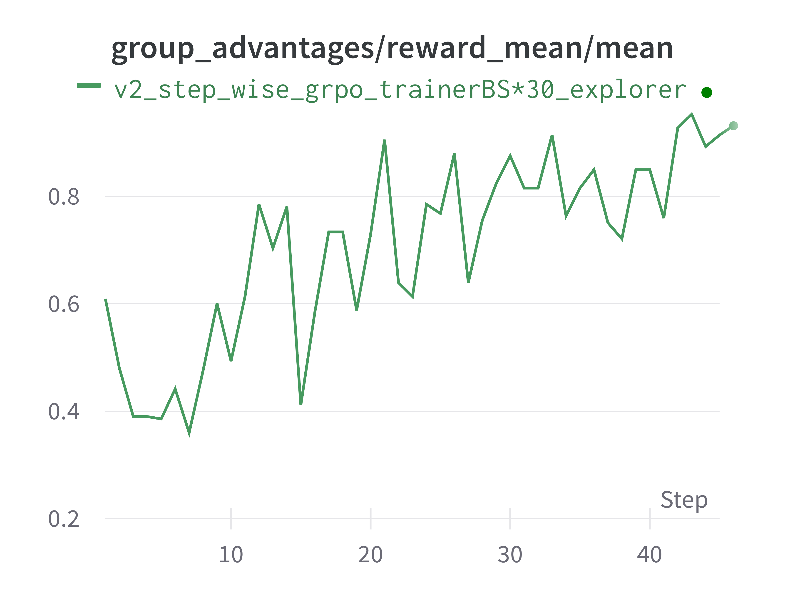

# ALFWorld with general multi-step workflow

This example shows an updated implementation for training ALFWorld, now built with a general, multi-step workflow.

For preparing the environment, please refer to the [documentation](../../docs/sphinx_doc/source/tutorial/example_multi_turn.md).
The config files are located in [`alfworld.yaml`](alfworld.yaml) and [`train_alfworld.yaml`](train_alfworld.yaml).

The training performance of this example is shown as follows:

  

Please note that the current version requires directly modifying `read_batch_size` and `ppo_mini_batch_size` in the code.
We are working on a future update to improve the framework and remove the need for these invasive edits.
