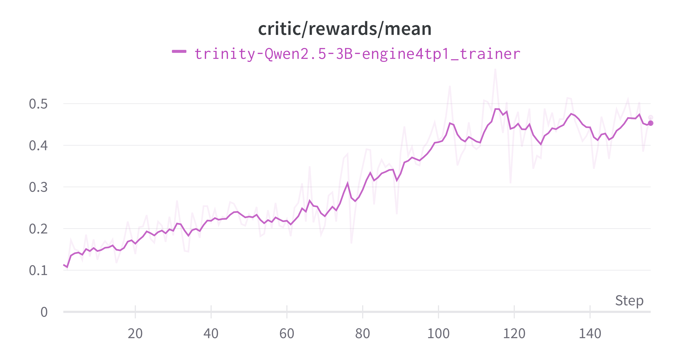

# Frozen Lake

This example shows the usage of GRPO on the [Frozen Lake](https://gymnasium.farama.org/environments/toy_text/frozen_lake/) task.

## Data and Environment Preparation

After setting up the basic environment following the [installation section of Quickstart](../../docs/sphinx_doc/source/tutorial/example_reasoning_basic.md#step-0-environment-preparation), you need to install the additional dependencies by running the following command:

```bash
pip install gymnasium[toy_text]
```

Then, we prepare the dataset by running the following command:

```bash
cd examples/grpo_frozen_lake
python get_frozen_lake_data.py
```

This command will save the dataset to the local directory `{DATA_ROOT_DIR}/frozenlake`, and print the path of the dataset. Afterwards, make sure to set the environment variable `TRINITY_TASKSET_PATH` to the path of the dataset.
```bash
export TRINITY_TASKSET_PATH={DATA_ROOT_DIR}/frozenlake
```


## Workflow Configuration and Training

We use a concatenated multi-turn workflow `FrozenLakeWorkflow` to solve the Frozen Lake task. For each rollout, the multi-turn interaction in between the agent and feedback from the environment are stored in a single `Experience` object.
The specific configuration is located in [`frozen_lake.yaml`](frozen_lake.yaml).

To run this example, you can use the following command:

```bash
trinity run --config examples/grpo_frozen_lake/frozen_lake.yaml
```

## Results
We show the result with a Qwen2.5-3B-Instruct model in the following. The figures demonstrate the reward increases over training steps.


